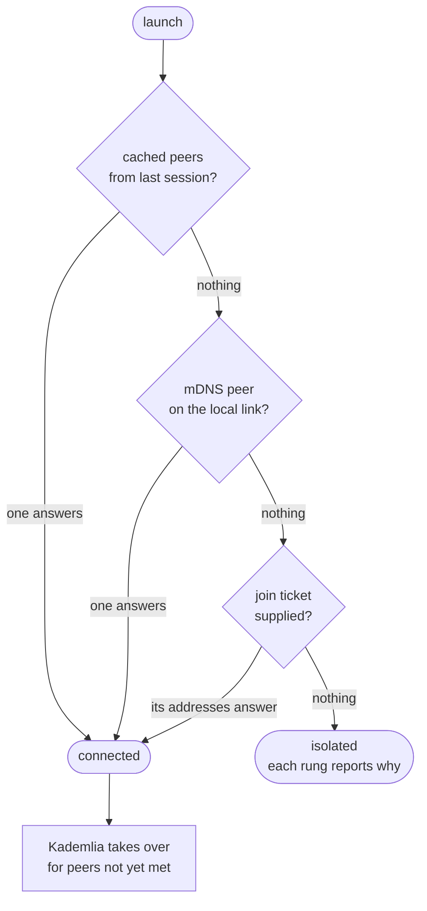
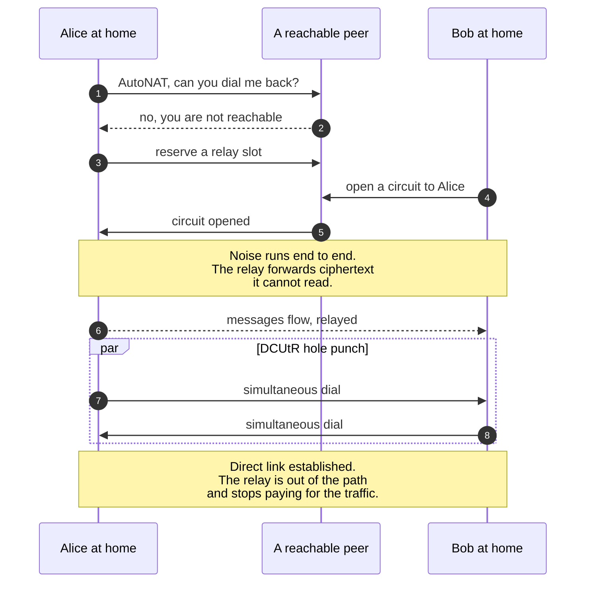
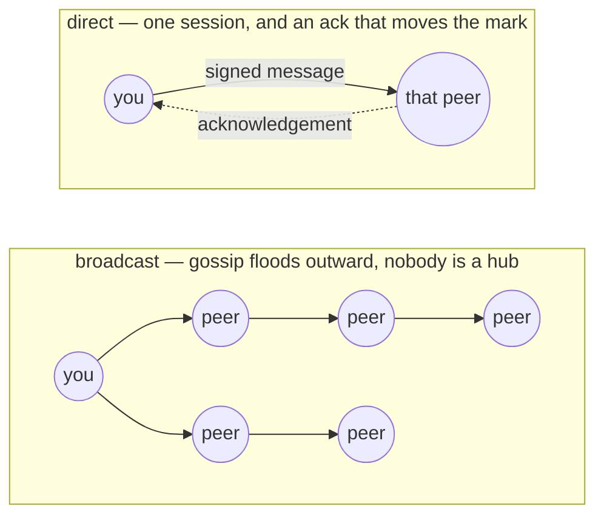
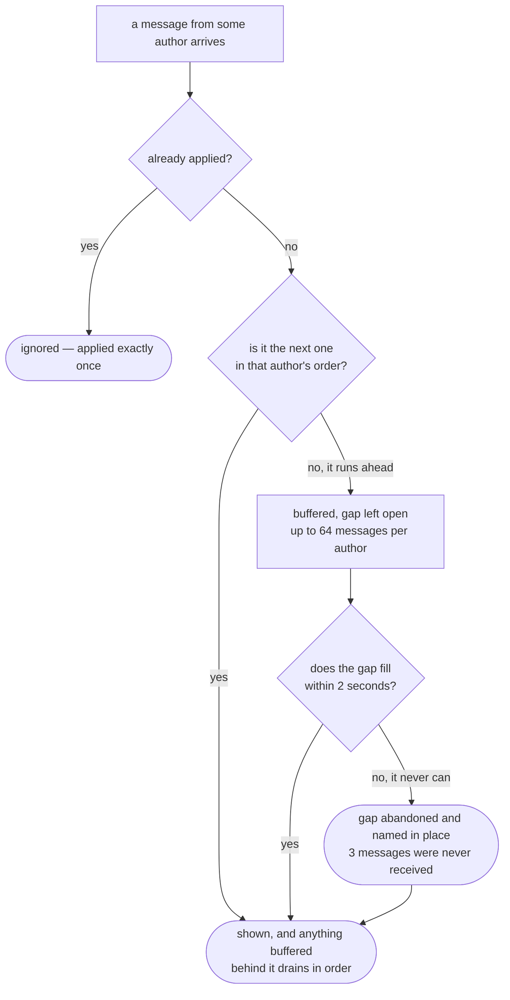
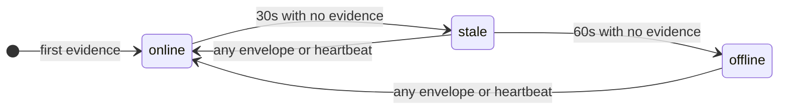

# distro

Serverless peer-to-peer text messaging. One binary, no account, no
configuration, and **no infrastructure** — no bootstrap host, no relay server,
no rendezvous point, no telemetry endpoint. The discovery, relaying and
hole-punch coordination a network like this needs are provided by the
participants: every instance offers all three to every other instance, and there
is no flag that turns any of them off. A peer that relays for you is somebody
else running the same program.

There are two places to talk: one network-wide broadcast channel, and 1:1
direct conversations with any peer you can reach.

## Build and run

```bash
cargo build --workspace
./target/debug/distro                 # launch: creates an identity, joins, opens the UI
./target/debug/distro --help          # every option, and the disclosures below
```

First launch creates an Ed25519 keypair in a profile directory
(`$XDG_DATA_HOME/distro`, or `$HOME/.local/share/distro`) and derives your
identity from it. Nothing asks you anything; there is no registration step,
because there is nothing to register with.

The interface is a terminal UI. `?` shows the keys and repeats the disclosures.

## How it works

Six problems have to be solved to talk to someone without a server in the
middle: knowing who they are, finding them, reaching them through a NAT, getting
bytes to them, putting those bytes in order when the network reorders and drops
them, and noticing when they leave. Here is how each is handled.

### Identity: a name nobody issues

There is no account and no registry, so an identity cannot be *assigned* — it has
to be self-proving. On first launch the app generates an **Ed25519 keypair**, and
your `PeerId` **is** the public key, not a lookup into anything.

That single choice removes a whole class of problem. Claiming to be someone else
would mean producing their public key's signatures, so impersonation reduces to
breaking the signature scheme. No name server has to be trusted, because no name
server is consulted. Two peers who have never met, and no third peer they both
trust, can still verify every byte that claims to come from each other.

What a `PeerId` cannot tell you is which *human* holds it. That is the
trust-on-first-use gap, and the app does not paper over it: a peer starts
`unverified` (`?`), and you promote it to `verified` (`✓`) only after comparing
**fingerprints** out of band — a SHA-256 digest of the key, rendered as
`2876 ce56 507e ab16 …` and shown with `f`. Read it aloud on a phone call,
compare it in person. Until you do, you know the messages are consistently from
*one* key, not whose key it is.

Display names are decoration. They are never unique, never used for addressing,
lookup, or equality, and a remote peer's chosen name is never even stored — a
name is precisely the field an impersonator would set, so nothing depends on it.

### Finding each other: three rungs

Three paths, tried in that order, and the first that answers wins:

1. **Cached peers.** Peers from previous sessions, written to the profile when
   you quit and read back on launch.
2. **The local network.** mDNS on the local link, unconfigured. Two instances on
   one LAN find each other with no ticket and no setup. Off with `--no-lan`.
3. **A join ticket.** A string any member generates (`g`) and hands over out of
   band — chat, email, a photo of a screen. The recipient pastes it (`p`, or
   `--ticket <STRING>`). It carries the issuer's `PeerId`, their addresses, the
   protocol version, and an expiry (24 h by default), and it is refused if it is
   stale or speaks a different major version.



The honest cost of having no servers: **the first-ever internet join of a fresh
install needs one pasted ticket.** Every alternative — a hardcoded bootstrap
list, a DNS seed, a rendezvous point — is a host somebody operates and pays for,
and can take down. After that first join the peer cache carries you, and on a LAN
a ticket is never needed at all.

Once connected, a **Kademlia DHT** takes over for finding peers you have not met.
Its routing table starts empty; the peers you already know seed it.

Reaching nobody is a normal state, not a failure. The status line says
`isolated`, and the notices pane says what each rung produced.

### Connecting: transports and getting through a NAT

Two transports, both authenticated and encrypted, chosen by what works:

- **QUIC over UDP with TLS 1.3** — preferred, because it traverses NAT best.
- **TCP with Noise and Yamux** — fallback, and what relayed circuits run over.

Home connections are the hard case: most peers are behind a NAT with no
reachable address. Three mechanisms, all provided by peers, handle it.

**AutoNAT v2** tells a peer whether it is reachable at all, by asking peers it is
already connected to try dialling it back. Without this a peer cannot know
whether to advertise a direct address or ask for help.

**Circuit Relay v2** is the fallback when two peers cannot dial each other: a
third peer that *is* reachable forwards the connection. This is the part that
would normally be a company's server farm. Here every instance runs the relay
**server** side unconditionally — there is no flag to turn it off, and a test
asserts the service is offered to strangers rather than merely compiled in. If
you are relayed today, someone else's laptop is carrying your traffic; when your
peer is the reachable one, you carry theirs. The relay cannot read what it
carries: the circuit runs Noise end to end between the two real endpoints.



**DCUtR** then tries to *escape* the relay. Both peers dial each other
simultaneously through the coordinated timing the relayed connection gives them,
and if the hole punch lands the traffic moves to a direct link and stops costing
the relay anything.

**If you have forwarded a port, you can say so.** All three mechanisms above
need another peer: observation needs several of them to report seeing the same
address, and a probe needs a server to dial back. The first instance on a
network has neither, so a freshly forwarded port would sit there working while
the peer waits for somebody who does not exist yet to notice. `--external-address
<MULTIADDR>` (repeatable) is the manual way out — the address is advertised from
startup, in announcements, DHT records and join tickets alike.

It is this peer's *own* address and is never dialled, so it is not the bootstrap
list this project does not have, wearing a disguise. And asserting it does not
make it true: it is the weakest of the three sources rather than the strongest,
observation and probing carry on regardless, and an asserted address that fails a
probe is reported `unreachable` rather than believed. A private or loopback
address is refused outright, with a note that mDNS already covers the local
network.

When it does not work, it says so. Two peers both behind symmetric NAT with no
reachable peer online cannot connect, full stop — a direct message fails with
`no relay available` rather than retrying into silence.

One subtlety worth naming: in a symmetric network both sides frequently dial each
other at the same moment, leaving two connections where one is wanted. Both peers
resolve it identically without negotiating — **the session opened by the
numerically lower `PeerId` survives** — so they never disagree about which link is
real.

### Talking: envelopes, the channel, and directs

Everything on the wire is an **envelope**: a protocol version, a payload kind,
the author's `PeerId`, an opaque payload, and an Ed25519 signature over all of it.
The signed bytes have a pinned, documented layout that is independent of the
encoding, so a signature stays verifiable across versions. **A message whose
signature does not verify is rejected at the boundary and never reaches anything
you can read** — and the author of a message is defined as the key that signed it,
never as a field in the payload. That is enforced by the type system rather than
by discipline: the value proving an author was verified can only be produced by a
successful signature check.

The two places to talk work differently on purpose:

**The broadcast channel** (`/distro/broadcast/1.0.0`) uses **gossipsub**. You
publish to your neighbours, they publish to theirs, and the message floods the
network without any peer being a hub — which matters because a hub would be both
a bottleneck and a de-facto server. Broadcast messages are **signed but not
confidential**: every member can read them. That is what a network-wide channel
is. The topic name doubles as a network identifier — peers on different topics
are simply on different networks.



**Direct messages** (`/distro/direct/1.0.0`) go over the authenticated session to
that one peer, as a request/response exchange, so the acknowledgement is what
moves a message from `pending` (`·`) to `delivered` (`✓`). If the transport
refuses or times out, the message shows `✗` with the reason. There is one
attempt, not a retry loop — you decide whether to resend, and you are never left
watching a message that silently went nowhere.

### Order and loss: the hard part

No global clock exists, and no peer can be trusted about time — a claimed
timestamp is just a number the sender chose. So ordering uses **per-author
sequence numbers**: every author counts its own messages, per conversation,
and receivers reassemble each author's stream in the author's order.

That gives three cases, and the interesting design is in the third.

*In order* — apply it immediately.

*Out of order* — gossip reorders constantly, so a message arriving early is
**buffered, not dropped**, and becomes visible once the gap in front of it fills.
Up to 64 messages per author wait this way.

*Permanently missing* — and this is where a naive implementation breaks. Gossip
is best effort: some messages never arrive, and a peer that joins mid-conversation
has missed everything before it arrived. If a gap can never close, waiting
forever means that author goes permanently silent to you. So a gap that stays
open for **2 seconds** — long enough for any real reordering, short enough that
you do not sit staring at nothing — is **abandoned explicitly**: the log skips
past it and the conversation shows *"3 messages from 2876 ce56 were never
received"* in the place where they belong.



Nothing is lost silently in either direction. A message that turns up after its
gap closed is reported as too late, not quietly discarded, and never reordered
into history behind your scroll position. Duplicates — which gossip also produces
routinely — are applied exactly once.

One consequence is deliberate: **your outbound counter persists with your
keypair.** An earlier version kept it in memory, and a peer that restarted resumed
at 1 while everyone else still expected 47 — so every message it sent was
discarded as a duplicate and it went *silently mute forever*. Identity and message
ordering share a lifetime for that reason.

### Presence: who is still here

Nobody can announce that someone else left, so presence is **derived from
evidence**, never asserted. Every peer sends a signed heartbeat every **10
seconds**, and any envelope from a peer is evidence it is alive. A peer is
`online` while evidence is under 30 seconds old, `stale` under 60, and `offline`
beyond that. Pulling the plug on a machine therefore looks exactly like it
should: the peer stops producing evidence, and everyone independently concludes
it is gone within the window. No message needs to be delivered for that to work.



Nothing above is a message anyone sends *about* a third peer — each peer reaches
these conclusions on its own, from what it has and has not heard.

### Versions, and why peers upgrade independently

There is no coordinated deploy — no operator to roll out a new version, so two
versions of the app will meet on the same network the day after any release.
Every envelope carries a `major.minor` version, and the rule is fixed from the
first commit: **same major, newer minor → accept it and ignore what you do not
understand; different major → refuse it and say why.** Unknown fields and unknown
message kinds are counted as diagnostics rather than treated as corruption, so a
newer peer can add things without breaking an older one.

### Limits, because there is no gatekeeper

An open network has no doorman, so every limit is enforced locally by each peer:
envelopes over **32 KiB** are refused before they are even parsed, message bodies
cap at **16 KiB**, tickets at **4 KiB**, and there are ceilings on inbound rate
per peer, buffered messages per connection, concurrent sessions, and how much
relay service any one peer can consume. Identities are free to create, so these
are per-peer limits plus a local blocklist — there is no global reputation, and
there is deliberately nobody who could operate one.

## What you should know before joining

Two facts this project states rather than leaves to be discovered. They are also
in `--help` and behind `?` in the interface.

**Joining is public.** Joining announces this peer's network addresses to the
network. Messages on the broadcast channel are readable by every member — that
is what a network-wide channel is. Direct messages are encrypted end to end by
the transport, including when a third peer relays them; a relay carries
ciphertext it cannot read. Nothing else leaves the machine, and there is no
telemetry.

**Some pairs of peers cannot connect.** If two peers are both behind symmetric
NAT and no publicly reachable peer is online to relay for them, they cannot
reach each other. This is inherent to a network with no operator-run
infrastructure: every relay here is another user's instance. It is not a defect
and no amount of retrying fixes it — a direct message fails with
`no relay available` and says so.

## What v1 is not

Text only. Conversation history lives in memory and is gone when the process
exits — only the identity, the trust records, the peer cache and the outbound
sequence counter persist. A peer that is offline when you write to it does not
receive the message later; there is no store-and-forward. A peer joining the
broadcast channel sees what is said from then on, not what was said before. No
voice, no video, no file transfer, no rooms, no editing or deleting a message,
no multi-device identity, no mobile build.

Trust is trust-on-first-use: compare fingerprints out of band (`f`) before
marking a peer verified (`v`). Blocking (`b`) is purely local — it stops content
reaching you and tells no one.

## Where things are

| | |
| --- | --- |
| [`src/app/README.md`](src/app/README.md) | running it: options, keys, the profile directory, and the two-instance procedure |
| [`docs/specs/`](docs/specs/) | the REASONS canvas this is built from, and the analysis behind it |
| [`AGENTS.md`](AGENTS.md) | contributing: layout, dependency rules, the four checks |

The canvas is the implementation source of truth. Its safeguards — no
operator-run infrastructure, wire compatibility from the first commit,
hostile-input caps, determinism in tests — are checked by the test suite, not
only asserted in prose.

## Checks

```bash
cargo test --workspace
cargo build --workspace
cargo fmt --all -- --check
cargo clippy --workspace --all-targets -- -D warnings
```

A handful of tests need to bind a local socket and skip, loudly, where the
machine forbids it. Set `DISTRO_REQUIRE_NETWORK_TESTS=1` to turn that skip into
a failure — on any machine that has networking, that is the setting you want.
