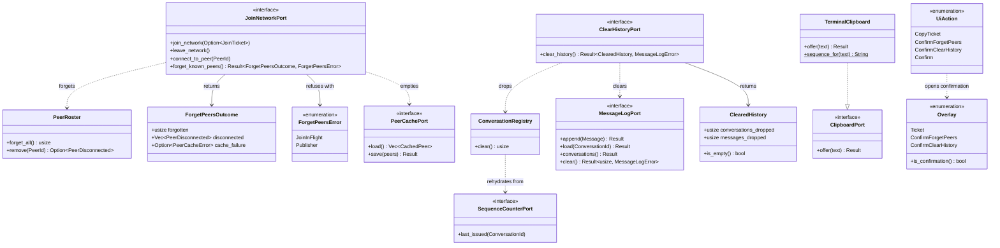

# REASONS Canvas — Clearing local state, and copying a join ticket

**Status:** **IMPLEMENTED 2026-08-07.** All nine operations complete; workspace 1590 tests, all four gates clean. Subordinate to `AGENTS.md` and to the system canvas `0002`, which this one **amends in two places** — safeguard S8 and AC7, both landed in `4029559` (see §7/S5 and §7/S6). Reconciled against the code by `$spdd-sync` on 2026-08-07; the drift it found is recorded inline and dated, and nothing was relaxed silently.
**Input:** `docs/specs/0012-local-state-reset-and-ticket-copy-analysis.md`, with Q1–Q3 settled by the user on 2026-08-06 and Q4 settled here.
**Origin:** "i want to be to clear cached peers and chats; also i want to be able to copy join ticket with single click or button press, not copy from screen."

---

## 1. Requirements

### Outcome

A user can throw away what this instance remembers, and hand out what it is, without leaving the interface. Forgetting the peers it has cached leaves the next launch a genuine cold start. Clearing the chats leaves the screen empty without changing this identity's standing with peers that are still listening to it. And a minted join ticket reaches the clipboard by one keystroke rather than a mouse drag across a wrapped paragraph.

Nothing crosses the wire. No envelope, no `PayloadKind`, no `ProtocolVersion`, no `shared_types` change. Every effect is local to one instance — which is why the whole risk surface is *what else* gets destroyed alongside the thing the user asked to destroy.

### Acceptance criteria

| # | Criterion | Verified by |
| --- | --- | --- |
| A1 | Forgetting cached peers empties both `peers.cache` and the live roster; a subsequent quit does not write the forgotten peers back. | unit (fake cache, asserting order) + integration |
| A2 | After forgetting, the next join walks the ladder from a cold start: rung (a) finds nothing, and rungs (b)/(c) are attempted exactly as on first launch. | integration (sim) |
| A3 | Forgetting cached peers leaves `trust.records` untouched: a blocked peer stays blocked, a verified peer stays verified. | unit + integration |
| A4 | Forgetting cached peers leaves `identity.key` and `sequence.counter` untouched: the `PeerId` is unchanged and the outbound sequence does not reset. | integration (the AC16 shape, applied to forgetting) |
| A5 | Clearing chats empties every conversation's applied history **and** every buffered message, for the broadcast channel and every direct alike. | unit |
| A6 | After clearing chats, a message this peer sends is still accepted by a peer that was already online — the outbound mark did not move backwards. | integration (sim) |
| A7 | Clearing chats emits no `MessageGapClosed` for the forgotten range and reports no loss for messages applied before the clear. | unit |
| A8 | Both operations state what they did, with a count, and report a store that refused rather than averaging it into success. | unit (notice assertions) |
| A9 | Neither operation is reachable by a single unconfirmed keystroke. | unit (key-mapping table) |
| A10 | One keystroke on the ticket overlay offers the exact `JoinTicketCodec::encode` output to the clipboard — byte-identical, no wrapping, no trailing newline. | unit (clipboard fake) |
| A11 | The copy notice describes what was attempted, never a success the program cannot observe. | unit (notice assertions) |
| A12 | The help overlay lists all three new bindings, because `KeyBindings::HELP` remains their only source. | unit (structurally enforced today) |
| A13 | Forgetting is refused while a join is in flight, with a reason, and the roster is left alone. | unit |

### Exclusions

- **Durable chat history.** Clearing is not a reason to start storing; D7 of `0002` stands.
- **Clearing identity, trust, blocks or verification.** Deleting the profile directory is the whole-identity reset and already works. Trust is `identity`'s and is deliberately out of reach here (A3).
- **Selective clearing** — one peer, one conversation. Different design; needs selection semantics the overlay does not have.
- **Launch flags for either operation.** A destructive flag is one shell-history recall from erasing a profile nobody meant to touch.
- **Reading *from* the clipboard.** `p` already accepts a terminal paste; making it clipboard-driven is a separate change with its own failure modes.
- **The `src/app/` → `src/apps/tui/` move.** Required by the target layout eventually, forbidden here: relocation is its own commit, never bundled with a feature.

## 2. Entities



*(Synced 2026-08-07.)* Four corrections the implementation forced, none of them a change of intent:

- **`UiAction` is named for asking, not for doing.** The canvas drafted `ForgetPeers` / `ClearHistory`; the code has `ConfirmForgetPeers` / `ConfirmClearHistory` plus a single `Confirm`. `F` and `H` do not forget or clear — they open a question — and a variant named for the destructive act would have read like one that performs it at every call site. The fourth variant exists because the *answer* is one action regardless of which question is open.
- **`Overlay::is_confirmation`** is what the key map branches on, rather than matching the two variants by name. A third destructive question added later cannot then be accidentally left out of the branch that makes ordinary keys stop working.
- **`ClearedHistory::is_empty`** exists so the interface can say "there was no history to clear" instead of reporting a successful clear of nothing (A8).
- **`TerminalClipboard::sequence_for`** is split out from the write so the escape sequence can be asserted without owning a TTY. A test that needed a terminal would not be run, and the encoding is the part that has to be exactly right.

### Invariants this work must not break

1. **The outbound mark is not history.** `sequence.counter` survives every clear (`0002` D12, AC16). A clear that reset it makes this peer permanently mute while its own screen looks correct.
2. **Trust is not membership.** `trust.records` is `identity`'s; forgetting peers never reaches it. A silent unblock is a security regression, not tidying (invariant 11 of `0002`).
3. **The read model cannot contradict itself.** The registry and the message log move together, or `conversations()` lists rows whose `history()` is empty.
4. **The domain reads no port.** `PeerRoster::forget_all` closes no session and writes no file; both are the application's to sequence (`0002` D11, S5).
5. **Nothing is announced off the machine.** Clearing chats publishes no domain event. No peer may learn that a user cleared their screen.

## 3. Approach

**D1 — Forgetting is leave, then forget, then an empty save — in that order, and the order is the feature.**
Sessions live *inside* roster entries. Forget the roster first and `leave_network` finds nothing to close: the transport keeps every link, the next inbound frame re-creates the entry through `record_discovery`, and the peer the user just erased is back within seconds. So `ForgetKnownPeersHandler` delegates to `LeaveNetworkHandler` first — closing every session, announcing every departure, and writing the cache from the roster — then empties the roster, then overwrites the cache with an empty set. The intermediate populated write is deliberate: it buys one code path for "close everything" instead of a second, near-duplicate one, and the final write is what the user asked for. *This is the analysis's R1 turned into a sequencing rule rather than a warning.* Rejected: forgetting the roster and letting the next quit persist the emptiness (the whole failure mode — a quit that never comes leaves the file intact).

**D2 — `PeerRoster::forget_all` returns a count and emits nothing.**
By the time it runs, D1 has already closed every session and published every `PeerDisconnected`, so there is nothing left to announce and `forget_all` is a pure drop. Rejected: a `forget_all` that closes sessions itself — it would need `PeerTransportPort` inside the aggregate, which the domain does not read.

**D3 — Forgetting is an `EngineCommand`; clearing chats and copying are not.**
`engine_command.rs` already states the rule and the reason: anything ending in a synchronous call into `infra-net-libp2p` blocks for up to `ResourceLimits::request_timeout` and would freeze the screen — including the status line that is supposed to be explaining itself. Forgetting closes every session, so it is the sixth `EngineCommand`. Clearing chats touches one `Mutex<BTreeMap>` and an in-memory log; copying writes bytes to the terminal. Both stay on the interface thread, beside `verify` and `block`.

**D4 — Clearing chats drops the registry's map, and the counter restores what must survive.**
`ConversationRegistry::modify` reopens a missing conversation through `Conversation::rehydrate(id, local, counter.last_issued(id)?)`, which inserts the local author's log at its persisted high-water mark and no messages. So dropping the map is *exactly* the right primitive: applied history and every author log go, and the outbound mark comes back from `sequence.counter` the moment the conversation is next touched. **A6 is satisfied by construction, not by care** — and the rule that makes it hold is stated as a prohibition, because the natural mistake is to be thorough: *nothing in the clear path may touch `SequenceCounterPort`.*

**D5 — `MessageLogPort` gains `clear()`, and all four implementations move together.**
The log is the mirror of what was applied and the source of the conversation listing. Four implementations: `store_fs::InMemoryMessageLog`, `sim_net::InMemoryMessageLog` — whose doc requires their behaviour to match, because the simulator is where multi-peer claims are verified — and the two fakes in `messaging::ports::port_fakes`. `clear()` returns how many messages went, so A8's count has a source, and `UnavailableMessageLog` refuses it like everything else.

**D6 — Clearing history gets its own inbound port; forgetting peers joins an existing one. The asymmetry is deliberate.**
`membership`'s `JoinNetworkPort` is documented as "the inbound port for decisions: join, leave, connect to a peer" — forgetting is a fourth decision of exactly that kind, sharing exactly those handlers, and a one-method port beside it would be a second name for one surface. `messaging` has no equivalent: `SendMessagePort` is the *composing* port, whose whole doc is about keeping the direct and broadcast paths separate, and a clear is neither path; `InboundEnvelopePort` is for reports the root drives; `MessagingQueryPort` only reads. So `ClearHistoryPort` is new, and `MessagingContext` gains a fifth service over the one shared registry.

**D7 — Forgetting is refused while a join is in flight.**
The ladder reads the cache on its own thread (`join_network.rs:195`); a forget landing between that read and the dial produces a join from peers the user just erased. `MembershipState::is_joining` already exists for the status line — this is its second reader. Refusal is a typed error, not a silent no-op (A13).

**D8 — `ForgetPeersOutcome` carries the cache's failure rather than folding it into an error.**
The operation is non-atomic in exactly one direction: the roster cannot fail to empty, the file can fail to be written. That is the shape `LeaveOutcome` already has (`cache_failure: Option<PeerCacheError>`), for the same reason, and it is what lets the interface say *"forgot 12 peers — but the cache could not be written, so they will be back next launch"* instead of reporting a success that is half true. `MembershipCommandError` is **not** extended: its doc explains three sources and states that the peer cache is absent on purpose, and that reasoning is still correct.

**D9 — OSC 52, and the notice describes an attempt.**
`ESC ] 52 ; c ; <base64> BEL` written to the terminal. Nothing answers it — there is no reply defined — so the program cannot know whether the terminal accepted, refused, or was configured to ignore it. "Copied" would therefore be a claim on evidence that does not exist, and this build does not make those. The notice names the mechanism so a user whose terminal has it disabled can tell why nothing pasted. Rejected (2026-08-06, user): `arboard` (reports its own failures, but links X11/Wayland/AppKit and fails over SSH and headless — the cases a terminal app is most often in); both with fallback; writing to a file instead.

**D10 — The clipboard is a port on the root, not on a context.**
It carries no domain rule, so it is not a context's contract; it is a device the terminal root drives, like the terminal itself. `ClipboardPort` lives in `src/app/src/tui/clipboard.rs` with `TerminalClipboard` writing OSC 52 and a recording fake for A10/A11 — every other adapter boundary in this workspace has a fake, and without one the copy path would be the only user-visible behaviour verified by trying it. **It must not later be lifted into a shared crate when `desktop` arrives**: per the target layout there is no `apps/common`, and a desktop clipboard is a different device with a different failure model.

**D11 — `base64` moves to `[workspace.dependencies]`.**
OSC 52's payload is base64 and `app` has no encoder. `base64 0.22.1` is already compiled for `infra-net-libp2p`, so this adds a graph edge, not a crate. It does contradict a comment: `infra-net-libp2p`'s manifest says "None of them is used by any other crate — that is canvas D2's containment rule made structural." The containment rule is about `libp2p`, `tokio` and `ciborium` — types that must not cross the adapter boundary — and base64 was never one of them. **Amend that comment to name the three crates it is actually about** rather than leaving a sentence the manifest disproves. Rejected: hand-rolling base64 (this project hand-wrote an argument parser to avoid a *large* dependency; a hand-rolled encoder on a string users paste between machines is a correctness risk for no saving); re-exporting the encoder from `infra-net-libp2p` (wrong layering — base64 is not a networking concern).

**D12 — Confirmation is an overlay that names what is about to be destroyed. (Settles analysis Q4.)**
`Overlay::ConfirmForgetPeers { peers: usize }` and `Overlay::ConfirmClearHistory { messages: usize }`. It is the only one of the three candidate shapes — second keystroke, overlay, typed word — that can say *what* is at stake before it is gone, and it reuses machinery that exists. `KeyBindings` gains a confirming branch in which `y` and `Enter` proceed and **every other key cancels**, so the failure mode of a mistyped confirmation is a no-op.

**Bindings.** `F` forgets cached peers, `H` clears chats, `y` copies the ticket while the ticket overlay is open. *(Synced 2026-08-07: `KeyBindings::HELP` did reach 16 entries, but by one row fewer than drafted. `y` gets a single line — "copy the ticket on screen, or confirm what was asked" — instead of a copy row plus a separate confirm row. Two rows both beginning `y` read as a contradiction on a help screen, which is the failure mode that constant exists to prevent.)* Uppercase for the two destructive actions is a safety signal and it keeps them off the row of single lowercase letters that already do things; in particular `C` is refused because `c` is *connect*, and that adjacency is exactly the class of mistake A9 exists for. `y` is mapped only when `Overlay::Ticket` is open and is `Ignored` otherwise — the key map already takes the overlay, so this is decided in the pure function and asserted in its table.

## 4. Structure

```text
src/contexts/membership/src/
├── domain/peer_roster.rs                     # forget_all() -> usize
├── ports/forget_peers_outcome.rs             # NEW: outcome + ForgetPeersError
├── ports/join_network_port.rs                # + forget_known_peers()
├── ports/port_fakes.rs                       # InMemoryPeerCache records each write
├── application/commands/forget_known_peers.rs# NEW: command + handler (D1, D7)
└── application/commands/join_network_service.rs # wires the handler in

src/contexts/messaging/src/
├── ports/message_log_port.rs                 # + clear() -> Result<usize, _>
├── ports/clear_history_port.rs               # NEW (D6)
├── ports/cleared_history.rs                  # NEW: outcome
├── ports/port_fakes.rs                       # both log fakes gain clear()
├── application/conversation_registry.rs      # clear() -> usize
├── application/commands/clear_history.rs     # NEW: command + handler
├── application/commands/clear_history_service.rs # NEW: the port impl
└── application/messaging_context.rs          # fifth service; into_parts -> 5-tuple

src/infrastructure/
├── store_fs/src/stores/in_memory_message_log.rs  # clear()
├── store_fs/src/stores/file_peer_cache_test.rs   # on-disk shape, test only
├── sim_net/src/stores/in_memory_message_log.rs   # clear(), behaviour identical
└── sim_net/src/harness/sim_peer.rs               # forget_peers(), clear_history()

src/app/src/
├── tui/clipboard.rs                          # NEW: ClipboardPort, TerminalClipboard, fake
├── tui/key_binding.rs                        # 3 actions, confirming branch, HELP grows
├── tui/ui_state.rs                           # 2 confirmation overlays
├── tui/screen.rs                             # renders them
├── tui/tui_app.rs                            # dispatch + notices
├── runtime/engine_command.rs                 # ForgetPeers (D3)
├── runtime/engine.rs                         # handles it
└── cli/usage.rs                              # fourth disclosure (S5)

Cargo.toml                                    # base64 -> workspace deps (D11)
docs/specs/0002-…-canvas.md                   # S8 and AC7 amended (S5, S6)
tests/integration/tests/local_state.rs        # A1, A2, A3, A4, A6
```

*(Synced 2026-08-07.)* Two entries the canvas did not anticipate:

- **`sim_net/src/harness/sim_peer.rs`.** OP-8's scenarios drive the two operations through the harness, so `SimPeer` needed `forget_peers` and `clear_history` beside its existing `join`/`leave`. Obvious in hindsight and missing from §4 as drafted — a reminder that an integration operation implies a harness surface, not only a test file.
- **`store_fs`'s change is in the *test* file, not the store.** `FilePeerCache` itself was not touched; see OP-6 below for why.

**Dependency direction, unchanged.** `PeerRoster::forget_all` and `ConversationRegistry::clear` are pure. The two handlers depend on domain and ports only. `ClipboardPort` is implemented at the root and nothing depends on the root. No context imports another. `shared_types` is not touched.

## 5. Operations

Each operation lands as its own commit with all four gates green, red-green-refactor, its own tests written first.

*(Synced 2026-08-07 — what actually landed.)* Six commits, not nine. **OP-2 and OP-3 are one commit** (`aac8e46`): a trait method with no implementation does not compile, and `JoinNetworkService` is `JoinNetworkPort`'s only implementor, so the port and its handler could not be separated without a red build in between. **OP-4, OP-5 and OP-6's two logs are one commit** (`46c3706`) for the same reason — adding a method to `MessageLogPort` breaks all four implementations until they move together. The rule the canvas was reaching for survives intact: no commit is red, and no commit mixes a refactor with a feature. Where a trait forces two operations into one commit, that is a property of Rust, not a relaxation.

**OP-1 — `PeerRoster::forget_all` (`domain-modeler`).**
Drops every entry and returns how many. No events, no transport, no clock (D2). Tests: forgetting an empty roster returns 0 and stays valid; forgetting a populated one leaves `len() == 0` and `known_peers()` empty; the local peer is unaffected because it was never an entry.

**OP-2 — The membership port surface (`domain-modeler`).**
`ForgetPeersOutcome { forgotten, disconnected, cache_failure }` and `ForgetPeersError { JoinInFlight, Publisher(EventPublisherError) }` (D8). `JoinNetworkPort::forget_known_peers()`. Update `ports/port_fakes.rs`. Tests: the outcome's constructors; that a `cache_failure` is representable alongside a non-zero `forgotten`.

**OP-3 — `ForgetKnownPeersHandler` (`application-handler`).**
Composes `LeaveNetworkHandler` → `PeerRoster::forget_all` → `cache.save(&[])`, in that order (D1), refusing up front when `MembershipState::is_joining` (D7). Wire into `JoinNetworkService`. Tests: **the write-back trap** — a fake cache records its writes; after forgetting, the last write is empty and a subsequent `leave_network` writes empty again; every live session is closed before the roster is dropped; a `PeerCacheError::WriteFailed` surfaces in `cache_failure` with `forgotten` still correct; a forget during a join returns `JoinInFlight` and the roster is untouched (A13).

**OP-4 — The messaging port surface (`domain-modeler`).**
`MessageLogPort::clear() -> Result<usize, MessageLogError>`; `ClearHistoryPort`; `ClearedHistory { conversations_dropped, messages_dropped }`. Update both log fakes — `UnavailableMessageLog` refuses `clear` as it refuses everything else. Tests: the fakes' clear semantics; that `conversations()` is empty after `clear()`.

**OP-5 — `ConversationRegistry::clear` and `ClearHistoryHandler` (`application-handler`).**
`clear()` drops the map under the lock and returns the count; the handler clears the registry, then the log, and returns `ClearedHistory`. Add `ClearHistoryService`, wire it into `MessagingContext` as the fifth service over the same registry, extend `into_parts` (currently unused in production — only named in a comment in `engine.rs`). Tests: **A5** history and buffered messages both gone, broadcast and directs alike; **A6/D4** after a clear, the next `append_local` issues a sequence *above* the pre-clear mark, proving rehydration from the counter — assert the counter port was never asked to reset; **A7** no `MessageGapClosed` is published by a clear; a log that refuses leaves the registry already cleared and reports the failure (A8).

**OP-6 — The infrastructure stores (`repo`).**
`clear()` on `store_fs::InMemoryMessageLog` and on `sim_net::InMemoryMessageLog`, behaviourally identical. Plus the `FilePeerCache` regression test that is missing today: `save(&[])` writes a file that is header-only, and `load()` on it returns an empty vector rather than `Corrupt`. That currently holds by construction — `render(&[])` produces no lines and `parse(&[])` returns `Some(vec![])` — and is untested, which is the same thing as unprotected.

> **⚠ Corrected 2026-08-07 — the canvas was wrong about what was missing.** `an_emptied_cache_stays_empty` already covered the round-trip, so half of this operation asked for a test that existed. What was genuinely uncovered is the **on-disk shape**: `an_emptied_cache_holds_a_header_and_nothing_else` now asserts the file is one header line with no peer line, that the forgotten peer's hex does not appear in it, and that a fresh reader loads it as empty. The distinction matters — a format change that wrote a placeholder line, or kept the old peers and marked them somehow, would still pass a round-trip and would still hand the next launch a warm start nobody asked for. `FilePeerCache` itself needed no change.

**OP-7 — The composition root (`spdd-executor`).**
`ClipboardPort` + `TerminalClipboard` (OSC 52 per D9) + recording fake; `base64` promoted to workspace dependencies and `infra-net-libp2p`'s containment comment amended (D11); `EngineCommand::ForgetPeers` and its engine arm (D3); `UiAction::{ForgetPeers, ClearHistory, CopyTicket}`; the two confirmation overlays and the confirming branch of the key map (D12); `KeyBindings::HELP` grown to 16 entries; notice wording for all three actions. Tests: the key-mapping table including **A9** (neither destructive action fires unconfirmed) and `y` mapping only under `Overlay::Ticket`; **A10** the fake receives exactly `JoinTicketCodec::encode(&ticket)`; **A11** the copy notice describes an attempt; **A8** the forget notice reports the count and names a cache failure when one occurred.

**OP-8 — Cross-context integration (`test-writer`).**
In `tests/integration/`, deterministic on the sim fabric: **A1** forget, then quit, and the cache is still empty; **A2** a peer that forgot rejoins from a cold start, with rung (a) empty and (b)/(c) attempted; **A3** a blocked peer is still blocked and a verified peer still verified after forgetting; **A4** the `PeerId` and the outbound sequence survive; **A6** a peer that cleared its chats is still heard by a peer that stayed online.

**OP-9 — Verification.**
All four gates. Then `$spdd-sync` against this canvas and against `0002`; drift is surfaced, never absorbed. The S8 amendment (§7/S5) lands as its own commit and is **not** a precondition for OP-1..OP-8 — but the copy feature must not be called done until it has.

*(Done 2026-08-07.)* All four gates clean, workspace 1590 tests. The S8 and AC7 amendments landed in `4029559` as their own commit, so the copy feature is done by this canvas's own condition. This sync is the reconciliation; its findings are the dated notes throughout.

## 6. Norms

- **Ubiquitous language.** *Forget* for peers, *clear* for history. The codebase already says "Forgets `peer` entirely"; the distinction is not cosmetic — one changes who this instance will try to reach, the other changes only what it shows.
- **Naming.** Ports keep the `Port` suffix, including `ClipboardPort` at the root. Handlers are named by intent (`ForgetKnownPeersHandler`), commands are imperative (`ForgetKnownPeers`, `ClearHistory`), outcomes are nouns.
- **Tests co-located.** `module_test.rs` beside `module.rs`, registered with `#[cfg(test)] mod module_test;`. Domain and application tests touch no clock, network or filesystem.
- **Every doc comment states the reason, not the mechanism.** In particular the prohibition in D4 belongs in `ClearHistoryHandler`'s doc: a later reader being thorough is exactly how the counter gets reset.
- **No assertion is weakened to make room.** `membership_context_test.rs` asserts that saves happen and that state carries over. Those tests are right; the new behaviour is an explicit exception recorded beside them.
- **One principal implementation per file**; `mod.rs` re-exports.

## 7. Safeguards

**S1 — The outbound counter is untouchable.** No code path added here may call `SequenceCounterPort` to reset, zero, or re-seed a mark. Enforced by A6 and by the prohibition living in the handler's own doc comment. Reintroducing the D12 defect is silent locally and total remotely: the peer goes mute while its own screen looks fine.

**S2 — Trust is out of reach.** No operation in this canvas may open, read or write `trust.records`, and none may call an `identity` command. A3 tests it from the outside.

**S3 — No destructive action without confirmation, and none from `argv`.** A9. Both operations are irreversible; neither gets a launch flag (a `--reset` shaped option is one shell-history recall from erasing a profile). Deleting the profile directory remains the documented whole-identity reset.

**S4 — Honest reporting, including about the clipboard.** A11 and A8. The program does not claim outcomes it cannot observe, and does not average a partial failure into a success. This is the same rule canvas `0010` was written to enforce, applied to three new sentences.

**S5 — Safeguard S8 of canvas `0002` is contradicted by the clipboard, and must be amended before this ships. `⚠ AMENDS 0002` — ✅ LANDED 2026-08-07 (`4029559`).**
S8 reads: *"Joining announces the peer's addresses to the network and broadcast messages are network-public; both stated in user-facing docs. **No additional data leaves the machine.**"*

A join ticket carries this peer's `PeerId` and endpoint list. Placing it on the system clipboard exposes it to every process that can read the clipboard and to any clipboard-history manager — and on macOS Universal Clipboard, Windows cloud clipboard and several Linux managers, to another device over a network the user did not choose. That last case makes S8's final sentence false.

The honest resolution is small: a sentence in S8 and a fourth entry in `Usage::DISCLOSURES`, saying that copying a join ticket puts this peer's addresses on the system clipboard and that a syncing clipboard manager will carry them off the machine.

*(Landed 2026-08-07.)* S8 now reads that **the only data this build puts anywhere the user did not point it is a join ticket the user explicitly copied**, disclosed in `--help` and in the help overlay. The absolute sentence was narrowed rather than dropped: there is still no telemetry, no analytics, and no endpoint this build contacts that a peer did not name. Rejected: keeping the absolute sentence and refusing the clipboard (the manual copy it forces is the friction the feature exists to remove); shipping the clipboard while leaving the sentence in place (a safeguard that is false is worse than one that is narrow). `usage_test.rs` asserts the disclosure is present, so it cannot be quietly dropped.

**S6 — Replay is re-armed by a clear, and this is stated rather than discovered. ✅ LANDED 2026-08-07 (`4029559`).** A cleared `AuthorLog` will accept a message it has already applied, so `0002`'s AC7 (exactly-once) is scoped to a run rather than to an identity. Every signature is still verified and every author policy still applies, so the exposure is redundant display, not forged content. `0002`'s AC7 now carries that clause.

**S7 — Determinism.** Every new test is free of real time, real sockets and real files, except the `FilePeerCache` test in OP-6, which is an adapter-boundary test on a tempdir and is exempt by the same rule that exempts the existing ones.

**S8 — The target layout is respected and not advanced.** New code lands in existing crates at their current paths. `ClipboardPort` belongs to the terminal root and must never move to a shared `apps/common` crate. The `src/app/` → `src/apps/tui/` relocation stays a separate, pure-move commit.

## 8. Agents

| Operation | Agent |
| --- | --- |
| OP-1, OP-2, OP-4 | `domain-modeler` |
| OP-3, OP-5 | `application-handler` |
| OP-6 | `repo` |
| OP-7 | `spdd-executor` |
| OP-8 | `test-writer` |
| OP-9 | `$spdd-sync`, then `$spdd-prompt-update` for S5/S6 |

**Scope and hand-offs.**

- **`domain-modeler`** owns `domain/**` and `ports/**` in both contexts: the roster primitive, the two outcome types, the two port contracts. It hands `application-handler` a compiling surface with fakes already updated, so OP-3 and OP-5 start green.
- **`application-handler`** owns `application/**`: both handlers, the sequencing that D1 makes load-bearing, the registry clear, and the context wiring. It does not touch `domain/**` — if a domain change is needed, that is a return to `domain-modeler`, not a reach across.
- **`repo`** owns the two infrastructure log stores and the `FilePeerCache` regression test. Bounded and independent of everything except OP-4's trait signature.
- **`spdd-executor`** owns `src/app/` as one slice — clipboard, key map, overlays, engine command, notices, and the manifest change. Deliberately not split: the engine command exists only to serve the keystroke, and four agents coordinating one keystroke path would be re-deriving each other's decisions. It holds no domain rule; if wiring needs one that does not exist, that is a gap to surface here, not to invent in the root.
- **`test-writer`** owns only the cross-context integration flows, because red-green-refactor puts each unit test inside the operation that needs it. Its job is the claims no single context can make alone.
- **`system-architect`** is not engaged: nothing crosses a context boundary and no dependency direction changes. `api-designer` is not engaged: there is no HTTP surface.

**Orchestration.**

1. OP-1, OP-2 and OP-4 run first and are independent of each other — `domain-modeler` may take them in parallel.
2. OP-3 gates on OP-1 + OP-2. OP-5 gates on OP-4. They are independent of each other and may run in parallel.
3. OP-6 gates on OP-4's signature only, so it can run alongside OP-5.
4. OP-7 gates on OP-2 (it calls `forget_known_peers`) and OP-4 (it calls `clear_history`), not on the handlers.
5. OP-8 gates on everything.
6. OP-9 last. The S5/S6 amendment to `0002` may be taken at any point and is a separate commit either way.

Max six concurrent threads per `.codex/config.toml`; results are reconciled here before OP-8 runs.

*(Synced 2026-08-07 — how it was actually run.)* The operations were executed **inline, in this order, by one session** rather than delegated to the six agents above: the session running `$spdd-generate` could not spawn subagents. Each operation was still kept inside its assigned layer, and the gates were run at each commit, so the ownership map below stands as the record of *who owns what* even though it was not the record of *who did what*. That distinction is worth keeping: the next change to `application/**` still belongs to `application-handler`, and the fact that one session wrote it this time does not make the boundary advisory.

## 9. Open confirmations

- ~~**S5 and S6 are amendments to `0002` awaiting `$spdd-prompt-update`.**~~ ✅ Both landed 2026-08-07 in `4029559`.
- **Key choices (`F`, `H`, `y`) are engineering defaults with a stated rationale (D12)**, not architecture. They may be changed without amending this canvas — provided the two destructive ones stay off the lowercase row and A9 stays green.
- **`ClearedHistory`'s two counts are for the notice.** Both are used: the notice reads "cleared N message(s) from M conversation(s)", and `is_empty()` distinguishes a real clear from a clear of nothing. Neither is a number nobody reads.

### What this sync did not find

Worth stating, because a reconciliation that reports only its findings looks like it went looking only for them:

- **No acceptance criterion was weakened, and none went unmet.** A1–A13 are each covered by the tests the operation that owns them wrote.
- **No safeguard was relaxed.** S5 and S6 were *made*, as planned and in their own commit; S1–S4 and S7–S8 hold unchanged.
- **No dependency direction moved.** `shared_types` is untouched, no context imports another, `ClipboardPort` is implemented at the root and nothing depends on the root, and `src/app/` is still the only composition root.
- **The `src/app/` → `src/apps/tui/` move stayed out**, as §1 excluded. It remains owed to the target layout, as its own pure-move commit.
